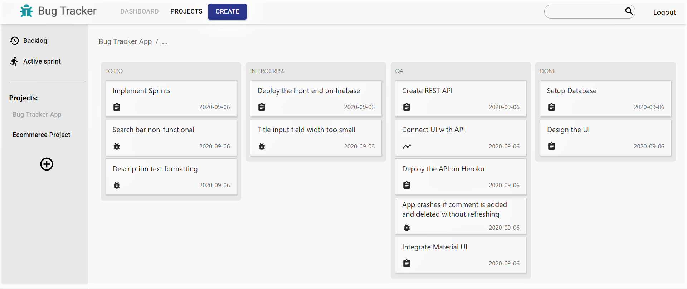

# About
A bug and task management application, that makes agile development easier for developers.
The front end is built with React and consumes a REST api that was built with NodeJS.

### Live link
- Click <a href="https://bug-tracker-6c802.web.app/"><strong>here</strong></a>
   
   

# Description
### Feature highlights:
- Authentication: Login-logout
- Authentication: Signup
- Create projects
- Create tickets (task/bug/story)
- Sort tickets based on their status (Todo/in-progress/done)
- Add comments to tickets
- Toggle between multiple projects
- Assign tickets to users (in progress)
- Notifications when tickets is assigned to you (in progress)

### Language, Frameworks and libraries
- React
- Redux
- Material UI
- JavaScript
- NodeJS
- ExpressJS
- MongoDB

### Screenshots:

  

 

  

# Notes on using the website
Project is hosted <a href="https://bug-tracker-6c802.web.app/"><strong>here</strong></a>
- If you do not want to register, press the skip button during login. This will log you in as a test user (test@test.com).
